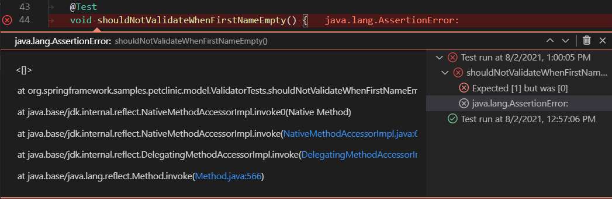
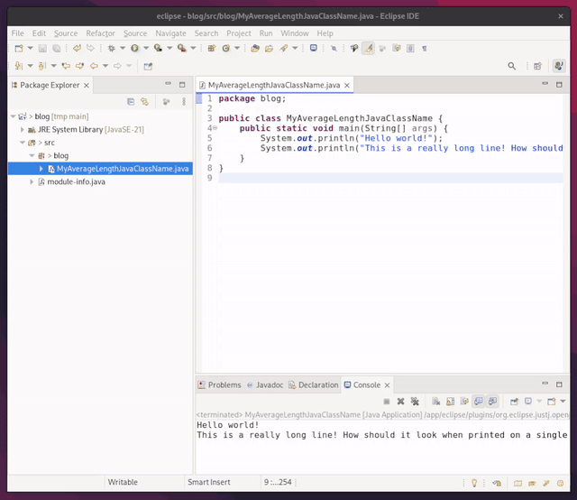
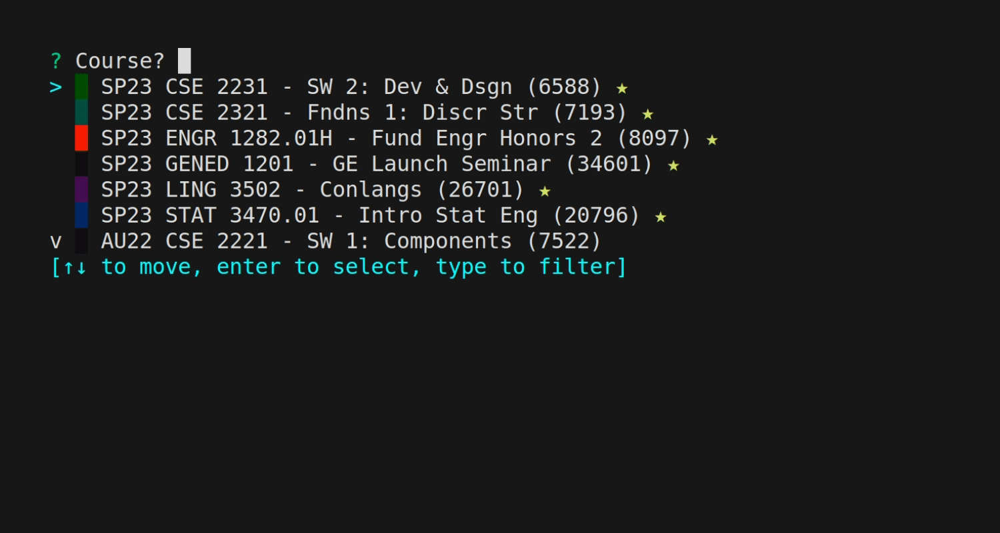
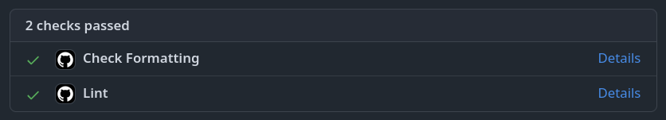
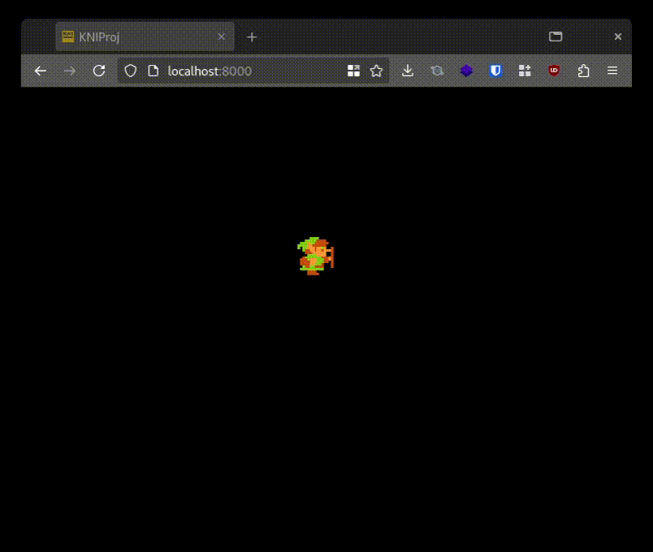
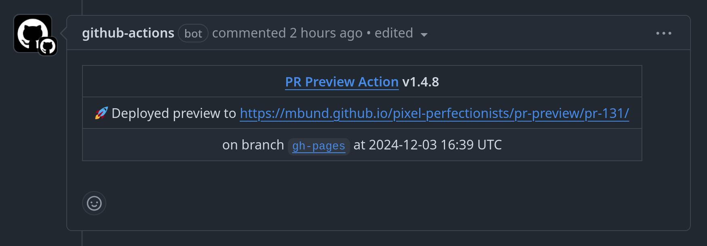

## Anything but Eclipse

Eclipse is the required IDE for the intro to Java classes at OSU, Software I and II. This is unfortunate for obvious reasons. But _how_ required is it?

- They provide starter templates which should be imported into Eclipse, but these are just zips that I can easily take all the `.java` files out of. ✅
- The Java project must not have any [checkstyle](https://github.com/checkstyle/checkstyle) warnings, and be configured with the courses's specific settings. Fortunately they provide the checkstyle config `OsuCseStyle.xml` so this is also relatively easy to configure in any editor. ✅
- You must submit valid Eclipse projects so graders can run them (side note: this seems reaallllly unsafe, and honestly grading these should be automated with ci/cd running their projects in isolated containers. But I digress, we're fixing Software I and II from the student's perspective, not the TA's 🤷 (then students can verify before they submit too...but I degress yet again)).
- A PDF must be printed to file for every `.java` file in the project. This is the tricky one which we'll take a closer look at later.

### VSCode Dev Environment

I'm not a master of Java build systems. I knew that I wanted to use vscode so I just did it the vscode way and did not introduce [gradle](https://gradle.org) or anything like that. The projects which are required in the class don't need all the bells and whistles provided by fancy build systems. I needed to link like, one `.jar` file. I used the following vscode extensions

- [Language support for Java™ for Visual Studio Code (`redhat.java`)](https://marketplace.visualstudio.com/items?itemName=redhat.java) for LSP
- [Debugger for Java (`vscjava.vscode-java-debug`)](https://marketplace.visualstudio.com/items?itemName=vscjava.vscode-java-debug) for DAP and running the project
- [Test Runner for Java (`vscjava.vscode-java-test`)](https://marketplace.visualstudio.com/items?itemName=vscjava.vscode-java-test) for running tests
- [Checkstyle for Java (`shengchen.vscode-checkstyle`)](https://marketplace.visualstudio.com/items?itemName=shengchen.vscode-checkstyle) for checkstyle linting (as per requirement 2)

Then after a little bit of configuring vscode's `settings.json` to find the right JDK as installed by my [`flake.nix`](https://nixos.org), it's off to the races. Now I get nice interactions with Java, even running tests inline. That is to say that it is about as nice as Java can be to write...so...yay...?



### Templating Eclipse Projects

Now the project has a nice and flat file structure, looking something like

```
.vscode/settings.json
src/*.java
test/*.java
checkstyle.xml
flake.nix
flake.lock
```

The reverse of requirement 1 can be done to generate an Eclipse project in the way the grader's expect one. Just unzip their template, delete all their `.java` files (and `bin` files...I have no idea why they're in there to be honest), and copy in my own `src/*.java` and `test/*.java` files, then re-zip it!

```bash
cp -r --no-preserve=mode,ownership ${projectTemplate} project
rm -rf project/{src,test,bin,lib}
mkdir project/{bin,lib} # the dirs need to exist for some reason even if they're empty...
sed -i 's/${projectTemplateName}/${projectName}/' project/.project
mkdir project/{src,test}
cp src/*.java project/src
cp test/*.java project/test
cd project && zip -r ../project.zip . && cd ..
cp project.zip "$out/${projectName}.zip"
```

Of course it is a shell script so that I can use it throughout the semester. Ain't no way I'm going to zip the same thing for 8 different projects by clicking through a GUI.

### Printing Code to File

And now for the most tedious requirement of them all. The graders need to mark up the code, and [Canvas](https://instructure.com/canvas) (the Learning Management System (LMS)) that OSU uses only supports adding comments to PDFs. So for every submission, every Java file needs to be printed to a PDF in Eclipse. Take a look at the excruciating horror of this activity in the gif below, if you dare.



The filenames of the PDFs have to be the same as the Java file name/class name, but Eclipse doesn't automatically name the file correctly so I have to type it in manually for every file. The only speedup that isn't in the gif would be to use `Ctrl+P` to print instead of going to `File -> Print` with the mouse. In total throughout the course I had 35 Java files which needed to be exported. And keep in mind that that number does not include multiple submissions, so if I realize I made a mistake before the deadline I'd have to reprint all the changed files again (and I can tell you that I did, a number of times throughout the semester).

So to get away from Eclipse and to automate this, I needed to figure out a way to have the same printed PDF. Eclipse doesn't have a headless mode, which means I'd have to do a puppeteer-esque technique to print them out. Instead, it was easier to approximate what the output would look like by converting my `.java` files to PDF with good ol' HTML and CSS. This would be (slightly) less janky, and could run in CI where the containers are not very powerful and do not have full on desktop environments to be clicking around in.

One script later which calls [`pandoc`](https://pandoc.org) with some custom CSS to turn a `.java` into `.html`, then [`weasyprint`](https://weasyprint.org) to turn the `.html` into `.pdf`, and out comes a _very similar looking PDF_. The first PDF below is a sample Java file printed with Eclipse (from the gif above), and the second one is printed with the custom script.

<div class="flex flex-col md:flex-row h-[700px] md:h-[400px] xl:w-[150%] xl:-translate-x-[12.5%]">
  <iframe class="w-full h-full" src="MyAverageLengthJavaClassName-eclipse.pdf"></iframe>
  <iframe class="w-full h-full" src="MyAverageLengthJavaClassName-custom.pdf"></iframe>
</div>

It doesn't look quite the same, but it serves the same purpose, which is for graders to mark up the code. And, as a side note, Eclipse's printing is not perfectly consistent either. If you zoom in on the code view, it will zoom in on the print too. If you change the font in the editor, it will change the font in the print. And if you change the color theme, it will also change the colors in the print. Considering that, I think the script gets close enough (and I wanted to get started on actually working on the assigned projects eventually).

### CI/CD

Now all the building blocks have been set up to use vscode, and a lot of it has been automated with scripts. I like using continuous integration with GitHub Actions to validate that everything works on every push to the project. But what does continuous delivery mean in the context of a class assignment? Submitting it of course! Let's take a look at a high level overview of the workflow.

- Build all Java with `javac`
- Run `checkstyle` linting rules (error on warnings so we do not continue)
- Create the submittable `.zip` Eclipse project
- Render PDFs of all `.java` files
- Create a Release on GitHub with the assets to fossilize the submission
- Submit all the assets to the Canvas assignment 🚀

Thats right! Canvas is really cool [open source software](https://github.com/instructure/canvas-lms) with [JSON and GraphQL APIs](https://canvas.instructure.com/doc/api/). OSU uses a standard hosted instance by Instructure (the company which develops Canvas), where the API is enabled by default! So I [wrote a GitHub Action](https://github.com/mbund/canvas-submit-action) in TypeScript which uses the API to handle all the file uploads and doing the actual submission.

Here's an example workflow of using the Canvas Submit Action, [available on the GitHub Action Marketplace](https://github.com/marketplace/actions/canvas-submit-action):

```yaml
name: Submit
on:
  push:

jobs:
  build:
    name: Submit assignment
    runs-on: ubuntu-latest
    steps:
      - uses: actions/checkout@v3

      - name: Make
        run: make

      - name: Submit to Canvas
        uses: mbund/canvas-submit-action@v1
        if: contains(github.event.head_commit.message, ':rocket:')
        with:
          url: ${{ secrets.CANVAS_URL }}
          token: ${{ secrets.CANVAS_TOKEN }}
          file: upload-test.pdf
```

Where `CANVAS_URL` is something like `https://your.instructure.com/courses/123456/assignments/7891234`, which is the url that you get when you navigate to the assignment on the actual site.

## The Command Line Beckons

My freshman year roommate once asked me how I used my computer. I wasn't sure what he meant at first. But after asking more, it turns out that he wasn't confused by Linux or Gnome, he thought _vscode_ was my desktop environment, because I never left it. I realized that he was kind of right.

- Math homework? LaTeX, in vscode
- CS homework? See [above](#vscode-dev-environment) if it wasn't clear that was vscode
- Linguistics homework? LaTeX, in vscode
- Engineering and electives? Markdown which I render into PDF, in vscode
- Personal projects? In vscode

VSCode is my file manager, text editor, terminal emulator, and do-everything-er. It's emacs for zoomers. The one thing I used to do for school that was not already in vscode was using Canvas, because it is a website. So after the incredible revelation of learning about the Canvas API, I knew the next project I'd be working on.

I took what I learned from making the [Canvas Submit Action](#cicd) and turned it into a [tool to use Canvas from the command line](https://github.com/mbund/canvas-cli). Here is a gif of me using it to upload files to submit an assignment

<a href="https://github.com/mbund/canvas-cli">
  
</a>

It is a single static binary written in Rust. There is also functionality to use it programmatically instead of interactively, to download files from courses, and more coming soon! This has been a life changer for me, so I never have to leave vscode again.

(side note: check out [charmbracelet/vhs](https://github.com/charmbracelet/vhs), it is a super awesome tool that lets you automate generating GIFs of CLI tools like the one above)

(side note: I don't use LaTeX anymore, instead I use [Typst](https://typst.app) which is better in every way)

## Linting So I Don't Lose Points

OSU's Computer Science curriculum also includes C and x86 assembly courses, known as Systems I and II. Systems I has an extensive style guide for writing C code, which includes rules such as:

- All functions must have a comment above them
- No global variables
- Macros must be `SCREAMING_SNAKE_CASE`
- You must choose between either `snake_case` or `camelCase` for variables
- Functions cannot be more than 10 significant lines of code
- Try to avoid `goto`
- Prefer simple algorithms over fancy ones
- If `for` statements get too long, change it to a `while`
- ...and many more rules

After getting bit by some of them after submitting my first lab, I never wanted to make that mistake again. So I wrote a [linter](https://github.com/mbund/cse2421-linter) in Rust using [Tree-sitter](https://tree-sitter.github.io/tree-sitter) to statically parse the C code and check for these rules. Take the following file (`example.c`), as an example.

```c
#include <stdio.h>

#define pi 3.141592653589
#define TAU (2 * pi)

unsigned int globalOneThousand = 1000;

// Do some math
double calculate(unsigned long long x) {
  unsigned long long final_value;

  // make sure x is even
  if (x % 2 == 0) {
    final_value = x;
  } else {
    final_value = x + 1;
  }

  // multiply final value by 3/2
  final_value = final_value / 2;
  final_value = final_value * 3;

  // round final value down to nearest 100
  while (final_value % 100 != 0) {
    final_value--;
  }

  // multiply by tau for some reason?
  double actualFinalValue = final_value * TAU;

#ifdef DEBUG
  printf("The final value is %llu\n", final_value);
#endif

  printf("The actual final value is %f\n",
    actualFinalValue);

  return actualFinalValue;
}

int main() {
  double value = calculate(37);
  printf("The value is %f\n", value);

  return 0;
}
```

The linter produces the following output for the above C code.

```
example.c:3:9 Macro is not SCREAMING_SNAKE_CASE `#define pi 3.141592653589`
example.c:6:1 Global variable `unsigned int globalOneThousand = 1000;`
example.c:6:14 Camel case identifier contributes to case inconsistency `globalOneThousand`
example.c:9:8 Function has more than 10 lines (11) `double calculate(unsigned long long x) {`
  1) example.c:13:6 Counted if condition for 1 line `  if (x % 2 == 0) {`
  2) example.c:14:5 Counted expression for 1 line `    final_value = x;`
  3) example.c:16:5 Counted expression for 1 line `    final_value = x + 1;`
  4) example.c:20:3 Counted expression for 1 line `  final_value = final_value / 2;`
  5) example.c:21:3 Counted expression for 1 line `  final_value = final_value * 3;`
  6) example.c:24:9 Counted while condition for 1 line `  while (final_value % 100 != 0) {`
  7) example.c:25:5 Counted expression for 1 line `    final_value--;`
  8) example.c:29:10 Counted definition for 1 line `  double actualFinalValue = final_value * TAU;`
  9) example.c:35:3 Counted expression for 2 lines `  printf("The actual final value is %f\n",`
  10) example.c:38:10 Counted return for 1 line `  return actualFinalValue;`
example.c:10:22 Snake case identifier contributes to case inconsistency `final_value`
example.c:29:10 Camel case identifier contributes to case inconsistency `actualFinalValue`
example.c:41:5 Missing comment directly above function `int main() {`
```

The goal is not to catch every error with the automated linter. Some rules are far too nebulous to be a programmable rule. But for the ones that can be coded, the linter is conservative. Every lint that it detects is absolutely, positively, 100% in violation of the style guide. There are no "maybe" warnings. By the way, the starter code for one of the labs that you are not supposed to edit generates linting errors, and I don't know what to do.

### Electric Boogaloo

You know the drill by now. Let's make a GitHub Action. However, now we're dealing with C. This is not a write once, run anywhere kind of language (though it does run on _more_ than 3 billion devices). If `gcc` generates any warning, I get an immediate 0 on the lab. We're not dealing with peanut stakes here.

The required environment for the course is to write and run C code in `stdlinux`, which is just a server to `ssh` into that is hosted by the university. I prefer the development environment on my own machine, so I need to ensure that I am using the same compiler toolchain as the graders will be using. However I use NixOS, so binaries from other distros don't exactly just _run_. And I want the same environment in CI too. So I did the obvious thing and made a quick [docker container](https://github.com/mbund/stdlinux-compat/blob/main/Dockerfile) which is just pulling from the same version of Linux that `stdlinux` is running, namely `centos:7.9.2009`. Then it installs `gcc`, `make`, `zip`, and a few other tools needed to build.

By the way, the `stdlinux-compat` docker container I made is itself using a GitHub Action to build a `Dockerfile`, and publishes the image to `ghcr.io` (the GitHub Container Registry) so I can pull from it later.

Here's the high level overview of the complete workflow

- Build C code for the lab (error on warnings so we do not continue)
- Run the [custom linter](#linting-so-i-dont-lose-points) (error on status code so we do not continue)
- Build the `.zip` to submit, which is just a `make` target
- Unzip it into a new directory somewhere else, and `cd` there
- Build the C code again (error on warnings so we do not continue)
- Submit the `.zip` to the Canvas assignment with [`canvas-cli`](#the-command-line-beckons) 🚀

Notice that I didn't actually use the Canvas Submit Action. Instead, I just pulled the latest [GitHub Release from `canvas-cli`](https://github.com/mbund/canvas-cli/releases) since it is just a single static binary.

## A Fateful Decision

At OSU you have the option between 3 group project courses as a Junior. Web dev with Ruby on Rails, Game dev with C# (using Monogame/XNA), and compiler dev with Java. For some reason I chose Game dev 🤷.

### Argentblua

On my laptop I run Fedora Silverblue, an atomic Linux OS. The game design class is in C# with [Monogame](https://monogame.net). The recommended IDE is Visual Studio. This is a problem. Fortunately Monogame has instructions for install on Linux, though only for `Ubuntu 20.04`. No consideration has been given to Fedora, much less any immutable variant...so we're going to wing it. All we need is the dotnet toolchain, and some GTK libraries. I whipped up a [Nix](https://nixos.org) flake for it and...it didn't work. There is a special app called the MonoGame Content Builder which is required to bundle assets. It is configued with hard coded paths to look for fonts in. So, to package it for Nix would require patching. Instead, I just gave up and made a regular Fedora [Toolbox](https://github.com/containers/toolbox), installed dotnet and all the dependencies, and put vscode in it and just launch that vscode instance when I need to do work.

### Simple CI/CD

Let's start with some simple formatting and linting on PRs. C# has a built in [.editorconfig](https://learn.microsoft.com/en-us/dotnet/fundamentals/code-analysis/code-style-rule-options) file which can configure lints like making [Remove unnecessary using directives (IDE0005)](https://learn.microsoft.com/en-us/dotnet/fundamentals/code-analysis/style-rules/ide0005) cause an error instead of a warning. For formatting, I went with [csharpier](https://github.com/belav/csharpier) because the default C# formatter leaves a lot to be desired (why does it allow trailing whitespace after a line???). Now let's see what happens when we make a PR.



Beautiful.

For completeness sake, I'll include the workflows here, though they are very straight forward.

```yaml
name: Check Formatting
on:
  push:
  pull_request:
    branches:
      - main
jobs:
  format:
    runs-on: ubuntu-latest
    name: Check Formatting
    steps:
      - uses: actions/checkout@v4

      - name: Setup .NET Core SDK
        uses: actions/setup-dotnet@v4
        with:
          dotnet-version: 6.0.x

      - name: Install dependencies
        run: dotnet tool restore

      - name: Check Formatting
        run: dotnet csharpier --check .
```

And the `lint.yaml` just replaces the final step with `dotnet format analyzers project.csproj --verify-no-changes`.

### WASM Build

We're not even close to done yet though. The game is entirely single player written in C# with [Monogame](https://monogame.net) as I've noted before. I also happen to know that C# has [Blazor](https://dotnet.microsoft.com/en-us/apps/aspnet/web-apps/blazor) which compiles C# to WASM and uses it as a frontend framework. Theoretically, it _should_ be possible to compile the game to WASM, run it in the browser, and even have the preview of the current PR available. Earlier I said that "For some reason I chose Game dev 🤷". Let's just say that this idea was not an insignificant part in me making that decision.

I expected it to be pretty difficult though, basically adding in a whole new platform to support. It turns out there is a (sister?) project called [KNI](https://github.com/kniEngine/kni) which is a mostly-Monogame compatible C# game engine that is able to compile to WASM. But, as it is a class project, I can't just say we are switching game engines. My group is already tired of me adding linting rules. I can't just upend the whole build system. I need a system that can be pure MonoGame on the desktop, and KNI on the web.

The C# build system is...unique. The modifications I make will still need to work in Visual Studio on Windows, in VSCode on Mac and Linux, and of course on the Web. Time to learn about the `.csproj` file format!

We initialize KNI's [BlazorGL.NetCore](https://github.com/kniEngine/kni/tree/773cb4f7a42542a9fe4bc5c3fd9de07e5f3c8bfa/Templates/VisualStudio2022/ProjectTemplates/BlazorGL.NetCore) template into a new `webbuild` directory at the root of our existing MonoGame project. The directory structure will look like this:

```bash
project.csproj # generated from MonoGame template
project.sln    # generated from MonoGame template
Program.cs     # generated from MonoGame template (main entrypoint)
Main.cs        # generated from MonoGame template (main game class/loop)
# ...
webbuild/
  KNIProj.BlazorGL/         # generated from BlazorGL.NetCore template
    KNIProj.BlazorGL.csproj # generated from BlazorGL.NetCore template
    Program.cs              # generated from BlazorGL.NetCore template
    # ...
```

Side note: Visual Studio has project template syntax which this is using. This requires booting up a Windows VM, installing Visual Studio, installing the KNI dependencies, running the template, then finally copying the template out of the Windows VM. Here is a snippet as an example (note the `$safeprojectname$`)

```cs
namespace $safeprojectname$
{
    /// <summary>
    /// This is the main type for your game.
    /// </summary>
    public class $safeprojectname$Game : Game
    {
        GraphicsDeviceManager graphics;
        SpriteBatch spriteBatch;

        public $safeprojectname$Game()
        {
            graphics = new GraphicsDeviceManager(this);
            Content.RootDirectory = "Content";
        }
```

So now we have two completely independent C# projects in the same repo. We need to link them together somehow. Basically, we want to overwrite the root's `Project.cs` with our own in the `webbuild/KNIProj.BlazorGL` directory. The root's `Project.cs` is just a thin wrapper, here is the entire contents, where `Main` is the class defined in `Main.cs`.

```cs
using var game = new Main();
game.Run();
```

Let's edit the `webbuild/KNIProj.BlazorGL/Pages/Index.razor.cs`, which is the entrypoint of the Blazor WASM C# app to initialize and call our MonoGame app.

```cs
[JSInvokable]
public void TickDotNet()
{
    // init game
    if (_game == null)
    {
        _game = new Main();
        _game.Run();
    }

    // run gameloop
    _game.Tick();
}
```

But we can't just call `Main` here! It is in a different project. We need to introduce a shared C# project which refers to both projects to be able to link them together. Let's create some files in `webbuild/KNIProj.Shared/`.

Notably, we make a `KNIProj.Shared.shproj` which includes (among lots of boilerplate which has been omitted)

```xml
<Import Project="KNIProj.Shared.projitems" Label="Shared" />
<Import Project="$(MSBuildExtensionsPath32)\Microsoft\VisualStudio\v$(VisualStudioVersion)\CodeSharing\Microsoft.CodeSharing.CSharp.targets" />
```

Then we make a `KNIProj.Shared.projitems` which includes (again, sans boilerplate)

```xml
<ItemGroup>
  <Compile Include="$(MSBuildThisFileDirectory)\..\..\**\*.cs" />
  <Compile Remove="$(MSBuildThisFileDirectory)\..\..\Program.cs" />
</ItemGroup>
```

We go up two directories to include files from the root project. We include all `.cs` files in the root, and exclude the old entrypoint `Program.cs` from it, because we are now using our new `Index.razor.cs` to initialize `Main`.

Creating this `webbuild/` directory actually broke the build of the root project though. To fix we can edit the main `project.csproj` and exclude the entire `webbuild/` directory from the root MonoGame build:

```xml
<ItemGroup>
  <Content Remove="webbuild\**" />
  <Compile Remove="webbuild\**" />
  <EmbeddedResource Remove="webbuild\**" />
  <None Remove="webbuild\**" />
</ItemGroup>
```

Awesome! Now we can build our main project like before any of this (with a simple `dotnet run`, or pressing `F5` in Visual Studio). To build the `webbuild`, we run:

```bash
dotnet publish webbuild/KNIProj.BlazorGL/KNIProj.BlazorGL.csproj -c Release -o release --nologo
```

This creates a `release/wwwroot` directory which we can serve with any static file server. A simple `python3 -m http.server`, and we can view it in the browser!



Surprisingly, drawing, the keyboard input, and everything just works! `Console.WriteLine` gets converted to JavaScript's `console.log` and more. The only thing that needed some finagling was reading files from disk, like the sprites. But overall, KNI/Blazor handles everything very well!

### PR Previews

Let's take everything we've done so far and put it into a GitHub Action. We want to build the MonoGame project, build the WASM project, and deploy the WASM project to GitHub Pages. We can use the [rossjrw/pr-preview-action](https://github.com/rossjrw/pr-preview-action) which commits static files to the `gh-pages` branch of the repo. It doesn't support the new `actions/deploy-pages` method of deploying to GitHub Pages, but it is simple and works well.

```yaml
name: Deploy MonoGame Web PR Preview

on:
  pull_request:
    types:
      - opened
      - reopened
      - synchronize
      - closed

  workflow_dispatch:

permissions:
  contents: write
  pull-requests: write

concurrency: preview-${{ github.ref }}

jobs:
  preview-on-github-pages:
    name: Build and Preview
    runs-on: ubuntu-latest
    steps:
      - name: Checkout
        uses: actions/checkout@v4

      - name: Setup .NET Core SDK
        if: github.event.action != 'closed'
        uses: actions/setup-dotnet@v4
        with:
          dotnet-version: 6.0.x

      - name: Build .NET Core Project
        if: github.event.action != 'closed'
        run: dotnet build

      - name: Publish .NET Core Project
        if: github.event.action != 'closed'
        run: dotnet publish webbuild/KNIProj.BlazorGL/KNIProj.BlazorGL.csproj -c Release -o release --nologo && cp -r Content/bin/DesktopGL/Content release/wwwroot

      - name: Deploy preview
        uses: rossjrw/pr-preview-action@v1
        with:
          source-dir: release/wwwroot
```

So now when a PR is opened:



Clicking on the link will take you to the PR preview, where you can see the game running in the browser! This also has the added benefit of adding an implicit build check CI action, to make sure that the PR still builds and runs. GitHub is also able to parse out the output of the `dotnet build` command, and annotate the PR with generated errors.

## Conclusion

I still have a few semesters left, so if I come up with some other novel automation, I'll be sure to update this post. Thanks for reading!
