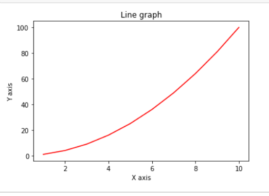

## Python is the Future

Python has an incredible data science ecosystem, and syntax which at a first glance seems simple. It's often recommended for beginner programmers because immense power is just one `import` away. I've spent some time with the language over the years, but I wouldn't say I truly _know_ it. Yet somehow I can't shake this feeling that people are too quick to recommend Python, and that they haven't gone beyond the surface level. Because given my experience with it, I could never recommend it with a straight face to anyone for production.

## Package Management is a Nightmare

> Just `pip install numpy` and you're good to go!

No.

This is the first line of most blog posts and tutorials for getting started with Python for data science, and it is **_completely incorrect_**.

Let's talk for a second about what `pip` is doing here. By running that command, you pollute your entire OS installation of Python with a particular version of `numpy`, whatever it happens to be at the time of you running the command. If you have multiple projects using `numpy`, your only option is to hope that they both are compatible with being the same version. This is a solved problem in any sane language with a lockfile, and per-project dependencies.

> Okay you're right, a README just giving `pip` commands is not best practice. Pythonistas include a `requirements.txt` to install from!

No.

A `requirements.txt` looks something like this

```
numpy==2.1.0
pandas==2.2.2
```

And you install the dependencies with

```bash
pip install -r requirements.txt
```

This still pollutes your global scope! And also, `requirements.txt` **is not a lockfile**. It is a list of dependencies with semver versions. It does not include hashes of all dependencies for the true versions, and it is missing other important information like the version of Python to use, and more.

The Python team recently added `--break-system-packages` for whenever you try to install with a `requirements.txt`.

> But...everyone knows that you have to use a `venv` to not clobber packages between different projects!

Yes, this is the official solution. And it...works...even if it is a little bit janky. It doesn't let you have multiple versions of Python itself, so that is still an unsolved problem. And as we'll see, there are also far deeper issues with many Python packages.

### FFI Turns the Headache into a Migraine

Python is a really slow language. The simple `for` loop is the bane of performance. So how is it "the best language" for AI tasks, which famously require tons of computation? Many libraries, like `numpy`, ship C code to do most of their computation, which is also why there are "duplicate" types like `numpy.array`, which are like arrays in Python, except faster. So now the package manager has to handle putting shared C object files into the right places, except that `pip` doesn't do that.

To install packages which have C dependencies in Python, typically OS maintainers wrap those packages to put the shared objects where they belong in the OS. In Ubuntu, what that means is that you use `apt` to install Python packages, like `sudo apt install python3-numpy`. This is awful for many reasons

- We are back to globally installing specific versions of packages (yay 🎉)
- Package maintainers for every OS now have to do a significant amount of extra work
- `apt` and `pip`'s subpar dependency resolution in concert has made me personally bork 2 separate Ubuntu installations permanently, and required fresh installs.

Keep in mind that for package maintainers, README's typically don't say what C object files they need to work. Even a transitive `numpy` dependency needs those files to exists. So you really do end up with the majority of PyPI in every distro's package repository. Package maintainers also have to patch `pip` to give errors to keep you from doing things which would break your system.

```
$ pip install -r requirements.txt
error: externally-managed-environment

× This environment is externally managed
╰─> To install Python packages system-wide, try apt install
python3-xyz, where xyz is the package you are trying to
install.
```

Also, `apt` and `pip` breaking my OS was the catalyst for me switching to [NixOS](https://nixos.org). The story for Python is even worse there, because Nix expects perfection, while Python leans on ad-hoc scripts and venvs which do not translate at all. So hacking on Python projects is a super-nightmare for me now, but at least my OS doesn't break anymore.

### What About Not Using `pip`

> Nobody uses `pip` anymore! We use conda or poetry!

Admittedly I haven't used conda much, but I agree that [poetry](https://python-poetry.org) is the only good Python package manager (update 2024-08-27: [uv](https://github.com/astral-sh/uv) is another incredible package manager for Python!). It has actual lockfiles and good practices. It can be translated into Nix very easily. Unfortunately most of the ecosystem hasn't adopted it, and the majority of packages are raw `pip`.

If you are using Python, _please please please please please_ use poetry.

## Dynamic Types

Python is dynamically typed, which is a mistake. It's basically impossible to know what any variable is. It's fine in small code snippets, but in the context of a large program, types are unquestionably a good idea. The JavaScript ecosystem realized this a few years ago and has been correcting its mistake by largely switch to TypeScript (or at least JSDoc). Python has also realized this and added a notation for types in the language.

```python
type Vector = list[float]

def scale(scalar: float, vector: Vector) -> Vector:
    return [scalar * num for num in vector]
```

The details of how this works is actually interesting. For variables, a `: T` is optional and treated as a comment. Similarly, `-> T` is treated as a comment. Then the `type` keyword and entire block is also ignored and treated as a comment. In many ways this is the best of how JS and TS interact, where you can add type annotations to Python which the interpreter itself actually just ignores, and no extra transpilation step is required (which also means no source maps!). Instead you run a linter (like [pyright](https://github.com/microsoft/pyright)) which analyzes those types, and gives you warnings and errors in your IDE or just on the command line.

Right now though it is too early. It has taken the JS ecosystem a decade to get _mostly_ on board with types. Many libraries for Python still are untyped, so your inference will be all screwed up. I have hope that in the future this will be a non issue. What I will say is that Python 2.7 is still in use today, more than 4 years after it has been discontinued.

## Error Handling

As with any language that uses `try`/`catch` for error handling, it is almost impossible to make a robust program. I can always tell when a program is written in Python. How?

```py
Traceback (most recent call last):
  File "/usr/share/virt-manager/virtManager/connection.py", line 1185, in _open_thread
    self.vmm = self._try_open()
  File "/usr/share/virt-manager/virtManager/connection.py", line 1167, in _try_open
    flags)
  File "/usr/lib/python2.7/dist-packages/libvirt.py", line 102, in openAuth
    if ret is None:raise libvirtError('virConnectOpenAuth() failed')
libvirtError: Failed to connect socket to '/var/run/libvirt/libvirt-sock': Permission denied
```

Any function can throw anything. So your only option is to wrap every function call in a `try:` `except:`. This is certainly possible, but in practice I've never seen it. The better alternative to `try`/`catch` is errors as values. Basically, in the return of the function signature, the possible errors are notated. Callers of the function are forced to lift out the value, and _at least_ acknowledge that an error is possible. There are some functions which don't throw errors, which is great, and we know that because it isn't in the function signature. In Rust, this is a `Result<T, E>`, in Go this is an `error` and the classic `if err != nil {}`, and in Zig this is a `!T`. Python has no equivalent, so I cannot in good faith recommend it as a language for production.

Also, here's a fun question: What is the difference between `my_func` and `my_func_2` below?

```python
def my_func():
    try:
        will_throw()
    except:
      print("Caught!")

def my_func_2():
    try:
        will_throw()
    except Exception:
      print("Caught!")
```

Just `except:` will catch all exceptions (those which inherit from `BaseException`), but `except Exception:` will only catch _most_ exceptions. For example, `my_func` will catch `GeneratorExit`, which `my_func_2` won't catch it! Indeed, Python's syntax is very easy and intuitive, and we should recommend it to beginners.

## Sharp Corners

Let's compare some code.

Here is a Python script to make a little plot.

```python
import numpy as np
import matplotlib.pyplot as plt

x = np.arange(1, 11)
y = x * x

plt.title("Line graph")
plt.xlabel("X axis")
plt.ylabel("Y axis")
plt.plot(x, y, color="red")
plt.show()
```



How nice. But does writing the above code mean that you know Python? Python here is really just glue, it is entirely replaceable. I think this is what many people think of when they talk about Python. It's nice and readable, even to those who haven't learned Python yet.

Let's take a look at Rust doing the same thing, but is of course a language which is considered difficult and hard to learn.

```rust
use pgfplots::{axis::plot::Plot2D, Engine, Picture, ShowPdfError};

fn main() -> Result<(), ShowPdfError> {
    let mut plot = Plot2D::new();
    plot.coordinates = (1..11)
        .into_iter()
        .map(|i| (f64::from(i), f64::from(i * i)).into())
        .collect();

    Picture::from(plot).show_pdf(Engine::PdfLatex)?;

    Ok(())
}
```

Sure, there are a few more features on display in Rust than Python. But it is not hard to grok either. In both cases, the library extracts out the difficult part. If you only look at a small subset of _any language_ in a beautiful example which ties things up in a little bow, of course it is going to look easy.

Let's take a look at a class from Python's standard library, which I think is pretty representative of moderately complex Python. You don't have to read the whole thing.

```python
class _Printer(object):
    """interactive prompt objects for printing the license text, a list of
    contributors and the copyright notice."""

    MAXLINES = 23

    def __init__(self, name, data, files=(), dirs=()):
        import os
        self.__name = name
        self.__data = data
        self.__lines = None
        self.__filenames = [os.path.join(dir, filename)
                            for dir in dirs
                            for filename in files]

    def __setup(self):
        if self.__lines:
            return
        data = None
        for filename in self.__filenames:
            try:
                with open(filename, encoding='utf-8') as fp:
                    data = fp.read()
                break
            except OSError:
                pass
        if not data:
            data = self.__data
        self.__lines = data.split('\n')
        self.__linecnt = len(self.__lines)

    def __repr__(self):
        self.__setup()
        if len(self.__lines) <= self.MAXLINES:
            return "\n".join(self.__lines)
        else:
            return "Type %s() to see the full %s text" % ((self.__name,)*2)

    def __call__(self):
        self.__setup()
        prompt = 'Hit Return for more, or q (and Return) to quit: '
        lineno = 0
        while 1:
            try:
                for i in range(lineno, lineno + self.MAXLINES):
                    print(self.__lines[i])
            except IndexError:
                break
            else:
                lineno += self.MAXLINES
                key = None
                while key is None:
                    key = input(prompt)
                    if key not in ('', 'q'):
                        key = None
                if key == 'q':
                    break
```

This looks nothing like the first script with `numpy` and `matplotlib`. Because it is real world Python, and the real world contorts fun into unfun.

What features do you need to know about Python to understand the above code?

- There are no private variables or functions, so it is convention to prefix private members with `__`, saying _please don't touch this :)_
- Multi line comments are just multi line strings, but you just ignore the return by not storing it in a variable and the interpret will ignore it
- [List comprehensions](https://en.wikipedia.org/wiki/List_comprehension)
- Certain `__myfunc__` functions are recognized by the interpreter to do special things. This is typically read out loud as "dunder myfunc"
  - `__init__` is a constructor
  - `__repr__` should return a printable string representation of an object, typically for use in the repl
  - `__call__` allows the instance of the class to be called with `()` like a function
- Tuples, `%` formatting, builtin functions like `range`, `input`, and more
  - Fun fact: `"Hello %s" % "World"` and `mod("Hello %s", "World")` are the same

In case you were wondering what this is used for, `license` is an instance of this class. You can use `license()` to print out Python's license.

```
>>> license()
A. HISTORY OF THE SOFTWARE
==========================

Python was created in the early 1990s by Guido van Rossum at Stichting
Mathematisch Centrum (CWI, see https://www.cwi.nl) in the Netherlands
as a successor of a language called ABC.  Guido remains Python's
principal author, although it includes many contributions from others.

...

Hit Return for more, or q (and Return) to quit:
```

You can also use `license` to read from any file on the system 🤔

```
>>> license.__class__("", "", ["passwd"], ["/etc"])()
root:x:0:0:root:/root:/bin/bash
mbund:x:1000:1000:Mark Bundschuh:/var/home/mbund:/bin/bash
gluster:x:965:965:GlusterFS daemons:/run/gluster:/usr/sbin/nologin
qemu:x:107:107:qemu user:/:/usr/sbin/nologin
saslauth:x:76:76:Saslauthd user:/run/saslauthd:/usr/sbin/nologin
unbound:x:968:968:Unbound DNS resolver:/var/lib/unbound:/usr/sbin/nologin
nixbld1:x:30001:30000:Nix build user 1:/var/empty:/sbin/nologin
nixbld2:x:30002:30000:Nix build user 2:/var/empty:/sbin/nologin
nixbld3:x:30003:30000:Nix build user 3:/var/empty:/sbin/nologin
nixbld4:x:30004:30000:Nix build user 4:/var/empty:/sbin/nologin
nixbld5:x:30005:30000:Nix build user 5:/var/empty:/sbin/nologin
nixbld6:x:30006:30000:Nix build user 6:/var/empty:/sbin/nologin
nixbld7:x:30007:30000:Nix build user 7:/var/empty:/sbin/nologin
nixbld8:x:30008:30000:Nix build user 8:/var/empty:/sbin/nologin
nixbld9:x:30009:30000:Nix build user 9:/var/empty:/sbin/nologin
nixbld10:x:30010:30000:Nix build user 10:/var/empty:/sbin/nologin
nixbld11:x:30011:30000:Nix build user 11:/var/empty:/sbin/nologin
nixbld12:x:30012:30000:Nix build user 12:/var/empty:/sbin/nologin
nixbld13:x:30013:30000:Nix build user 13:/var/empty:/sbin/nologin
nixbld14:x:30014:30000:Nix build user 14:/var/empty:/sbin/nologin
nixbld15:x:30015:30000:Nix build user 15:/var/empty:/sbin/nologin
nixbld16:x:30016:30000:Nix build user 16:/var/empty:/sbin/nologin
nixbld17:x:30017:30000:Nix build user 17:/var/empty:/sbin/nologin
Hit Return for more, or q (and Return) to quit:
```

It's even paginated for us, how nice. Also, that's right. Python has a whole class of vulnerabilities kind of like prototype pollution in JS. The language is clearly easy to learn and there are no sharp corners at all!

## The I in LLM Stands For Intelligence

Python is used in AI, and AI is particularly popular now, so Python is too. But following a youtube tutorial to make an AI model in 100 lines of code which starts with `import tensorflow` does not make you an expert in AI or Python.

And while I'm on the topic of AI, Integrating ChatGPT into your website does not put you ahead of the curve. You are still dependent on external libraries and services which need to be updated for the AI to perform better. You won't be "left behind" if you don't integrate AI today. There is no fundamental difference between adding an LLM and adding the [Pokémon API](https://pokeapi.co) into your program.

There are people actually doing novel research in AI. If you're interested in advancing AI, become a researcher and go deep. The next evolution is not a better prompt to an LLM, or even an LLM at all. Don't just be a consumer.

(section title shamelessly stolen from [`curl` maintainer Daniel Steinberg](https://daniel.haxx.se/blog/2024/01/02/the-i-in-llm-stands-for-intelligence))

## Conclusion

Nothing that I've said changes the fact that Python is legitimately useful for quick scripts and research, where a janky solution created as fast as possible is desirable, just to prove something out. But it is unsuitable for production grade applications. Once you go deeper, Python has sharp corners and its own weirdness just like every other language. Use Python for what it is good for, version 0. Then once you've proved out your idea, make a version 1 in a more suitable language. Don't be a one trick pony and use Python in places it doesn't belong. Practice your craft and truly understand the tools you use and where they are best suited. And maybe don't recommend tools to others if you only know them at a surface level.

P.S.

If you want to level up your Python skills, I highly recommend [mCoding](https://youtube.com/@mCoding). He makes excellent videos on intermediate level Python programming.
